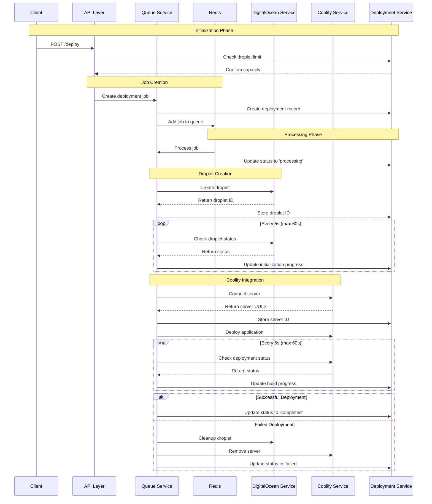

# Automated Deployment System

A robust deployment automation system that orchestrates the creation of DigitalOcean droplets and manages application deployments through Coolify, featuring environment variable management and job queuing.

## Architecture



Let me walk you through the deployment flow step by step:

1. **Initialization Phase**:
   - When a client makes a POST request to `/deploy`, the system first checks if we're within the droplet limit (max 3)
   - The `DeploymentService` validates this before proceeding

2. **Job Creation**:
   - A new deployment job is created with a unique ID (`deploy-${Date.now()}`)
   - The job is stored in the database via `DeploymentService`
   - It's then added to the Redis queue for processing

3. **Processing Phase**:
   - The queue processor picks up the job
   - Status is updated to 'processing'
   - All status updates are stored in both the job and database

4. **Droplet Creation**:
   - DigitalOcean droplet is created with name `eliza-${jobId}`
   - The system polls every 5 seconds for up to 60 seconds (12 attempts)
   - Waiting for the droplet to get a public IP address
   - Each attempt updates the deployment status

5. **Coolify Integration**:
   - Once the droplet is ready, Coolify server connection is established
   - Server UUID is stored in the job and database
   - Application deployment begins
   - Build progress is monitored every 5 seconds

6. **Completion/Failure Handling**:
   - On success: status is updated to 'completed'
   - On failure: 
     - Droplet is deleted
     - Coolify server is removed
     - Status is updated to 'failed'
     - Error message is stored

Key implementation notes:
- All operations are idempotent and tracked
- Comprehensive error handling at each step
- Automatic resource cleanup on failure
- Real-time status updates throughout the process
- Maximum timeout of 60 seconds for both droplet and deployment initialization


## Features

- **Automated Deployment Pipeline**: Streamlined process for creating droplets and deploying applications
- **Queue-based Processing**: Reliable job processing using Bull queue with Redis
- **Environment Management**: Comprehensive environment variable handling
- **Resource Cleanup**: Automatic cleanup of resources in case of deployment failures
- **Status Monitoring**: Real-time deployment status tracking
- **Rate Limiting**: Built-in droplet creation limits (max 3 active droplets)

## Core Components

### 1. Queue Service
- Manages deployment job queue using Bull
- Handles the complete deployment lifecycle
- Implements cleanup procedures for failed deployments
- Updates deployment status in real-time

### 2. DigitalOcean Service
- Creates and manages droplets
- Handles SSH key management
- Implements droplet status monitoring
- Manages resource cleanup

### 3. Coolify Service
- Manages server connections
- Handles application deployments
- Sets up default environment configuration
- Monitors deployment status

### 4. Deployment Service
- Tracks active droplets
- Manages deployment records
- Enforces resource limits
- Provides deployment status updates

### 5. Environment Service
- Manages environment variables
- Supports bulk updates
- Handles variable deletion
- Implements automatic application restart

## API Endpoints

### Deployment Endpoints
```
POST /deploy              # Initiate new deployment
GET  /deploy/:jobId/status # Check deployment status
GET  /droplets/count      # Get active droplet count
```

### Environment Endpoints
```
POST   /env              # Update single environment variable
PUT    /env/bulk         # Bulk update environment variables
DELETE /env/:uuid/:key   # Delete environment variable
```

## Configuration

The system requires the following environment variables:

```env
DO_API_KEY=your_digitalocean_api_key
COOLIFY_API_KEY=your_coolify_api_key
COOLIFY_API_URL=https://api.coolify.io
COOLIFY_PROJECT_UUID=your_project_uuid
COOLIFY_SSH_PUBLIC_KEY=your_ssh_public_key
REDIS_URL=redis://localhost:6379
```

## Deployment Flow

1. **Job Creation**
   - Validate droplet limit
   - Create deployment record
   - Add job to queue

2. **Droplet Creation**
   - Create DigitalOcean droplet
   - Wait for droplet initialization
   - Obtain public IP

3. **Coolify Integration**
   - Connect server to Coolify
   - Deploy application
   - Set up environment variables

4. **Status Monitoring**
   - Track deployment progress
   - Handle failures
   - Update status records

## Error Handling

The system implements comprehensive error handling:
- Automatic resource cleanup on failures
- Detailed error logging
- Status updates throughout the process
- Retry mechanisms for transient failures

## Limitations

- Maximum of 3 active droplets
- 60-second timeout for droplet initialization
- Specific Coolify configuration requirements
- Redis dependency for queue management

## Development

To set up the development environment:

1. Clone the repository
2. Install dependencies: `npm install`
3. Set up environment variables
4. Start Redis server
5. Run development server: `npm run dev`

## Error Codes

- `429`: Maximum droplet limit reached
- `404`: Deployment not found
- `500`: Internal server error

## Best Practices

- Monitor Redis queue health
- Regularly check deployment logs
- Implement proper error handling
- Keep environment variables updated
- Regular cleanup of stale resources
</antArtifact>